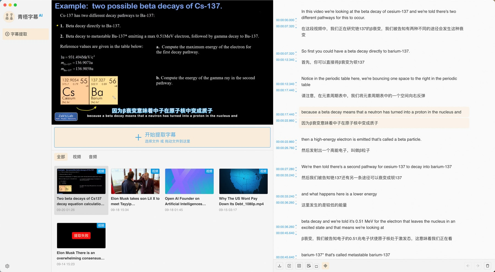

# 青梧字幕

青梧字幕是一款基于whisper的字幕自动提取工具。



青梧字幕AI文字提取程序底层使用的是C++版本的 [whisper.cpp](https://github.com/ggerganov/whisper.cpp)，前端界面使用 **Electron + vite + typescript** ，开源版本的青梧字幕是完全本地化的程序，除了第三方翻译过程外不需要联网，所有数据存于本地，数据库使用的是 **sqlite**。

## 0.官网

[https://zimu.qijingdict.com/zimu/home](https://zimu.qijingdict.com/zimu/home)

如果觉得自己编译环境搞不定，可以去[官网](https://zimu.qijingdict.com/zimu/download-software)下载完全编译好的版本体验。官网版本和开源版本的区别在于官网版本需要微信扫码登录，开源版本完全剥离掉了登录认证的流程。

## 1.安装


### 1.1 安装npm依赖

```
npm install
```


### 1.1 编译whisper


**注意：编译过程需要依赖`cmake`程序**，可以在[这里](https://cmake.org/download/)下载cmake安装程序安装。

如果安装后命令行里找不到`cmake`，那可能是环境变量没有配置，你需要先把环境变量配置好，使得当前环境能正常调用到`cmake`命令，相关教程可以自行搜索。

安装好后执行以下对应的命令（根据你的系统选择一个）即可完成编译。


#### Mac(Arm芯片)

```npm run build```

#### Mac(Intel芯片)

```npm run build-old-mac```

#### Windows

```npm run build-win```


### 1.2 运行

```
npm run dev
```

执行上述命令之后，就可以开始使用了。


## 2.Star History

[](https://api.star-history.com/svg?repos=melon/qingwu-zimu&type=Date)

## Licenses

This project is licensed under the [MIT License](/LICENSE).

This project also partially contains code derived or copied from the following projects:

- [whisper.cpp (MIT)](https://github.com/ggerganov/whisper.cpp/blob/v1.4.2/LICENSE)

Licenses of these projects are listed in [THIRD_PARTY_LICENSES](/THIRD_PARTY_LICENSES).
